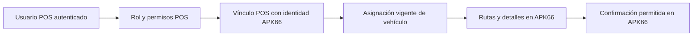

# Pilotos: descubrimiento e integración con APK66

Estado: análisis inicial y diagnóstico de solo lectura. **La vista y la confirmación
todavía no están implementadas.** Este cambio no modifica el comportamiento del
appweb ni ejecuta migraciones. La implementación continuará en la misma rama
después de recibir el esquema y las reglas operativas de APK66.

Base revisada: `develop`, commit `e98b09d8a3827ded58273dc72e614a97d39ba37c`
(17 de septiembre de 2026). Rama: `feature/pilotos-rutas-apk66`.

## Cómo obtener el contexto que falta

1. Abrir una ventana nueva de SSMS conectada a **APK66** y ejecutar completo
   [00_apk66_estructura_solo_lectura.sql](00_apk66_estructura_solo_lectura.sql).
2. Abrir otra ventana nueva conectada a **POS-SmartK66** y ejecutar completo
   [01_pos_estructura_solo_lectura.sql](01_pos_estructura_solo_lectura.sql).
3. Compartir todos los resultados, incluidos los vacíos y los errores.
   Si la aplicación que se va a probar usa otra base, indicar su nombre antes
   de adaptar el diagnóstico; no sustituir automáticamente producción por DEV.
4. Explicar qué significa confirmar: aceptar asignación, confirmar carga/salida,
   entrega u otro evento. Indicar si el vehículo es fijo o cambia por turno y
   quién asigna ese vehículo actualmente.

Los scripts solo leen catálogos de estructura. No consultan filas de tablas de
negocio, ejecutan procedimientos, crean objetos, cambian permisos o escriben
datos. Verifican la base seleccionada y rechazan sesiones con transacciones
abiertas o implícitas. Aplican `LOCK_TIMEOUT 3000` y restauran el valor anterior
en finalización normal o error capturado. No cambian el nivel de aislamiento.
Si se cancela desde SSMS, cerrar esa ventana para descartar ajustes de sesión.

Una consulta de metadatos también puede consumir recursos o esperar bloqueos:
el timeout limita la **espera por un bloqueo**, no el tiempo total. Si falla,
compartir el error en lugar de reintentar continuamente. No se necesita usar `sa`;
la visibilidad depende de los permisos de la cuenta existente. No interpretar
una sección vacía como prueba de que no existen relaciones o módulos.

La sección de dependencias requiere visibilidad de metadatos y acceso a
`sys.sql_expression_dependencies`; una definición puede no ser visible por permisos
o cifrado. Véase [documentación de Microsoft sobre dependencias](https://learn.microsoft.com/en-us/sql/relational-databases/tables/view-the-dependencies-of-a-table).
El script no concede permisos. Una ausencia de dependencias no descarta SQL
dinámico, consultas desde otras bases ni lógica en una aplicación externa.

Una segunda consulta, después de revisar estas salidas, pedirá únicamente las
definiciones de los módulos relevantes y ejemplos mínimos anonimizados con
columnas explícitas e índices conocidos. No se requiere enviar contraseñas,
cadenas de conexión, copias de la base ni listados completos de usuarios.
Si las transiciones están implementadas en otro programa, hará falta el código
de esa operación o su especificación, además del esquema SQL.

## Hallazgos comprobados en develop

| Área | Evidencia | Consecuencia para pilotos |
| --- | --- | --- |
| Plataforma | UI ASP.NET MVC 5.2.9, proyectos .NET Framework 4.5, EF 6.4.4 | Integrar en Entities/DAL/BLL/UI y registrar nuevos archivos en los `.csproj` existentes. |
| Identidad | `Usuario` usa `Usuario_Id` (`long`) y `Login`; `UsuarioBL.ValidarUsuario` comprueba `Activo` y `AutenticarSite` | Mantener cuentas y credenciales en POS; resolver la identidad desde el usuario autenticado. |
| Roles y permisos | `Rol`, `Usuario_Rol`, `Permiso`, `Rol_Permiso`; `RolBL.UsuarioTieneRol` y `AutorizacionPermisoPorUsuario` | Usar el sistema existente; no crear un segundo login en APK66. |
| Menú | `MenuBL.ObtenerMenuPorUsuario` filtra por permisos en padres e hijos | Habilitar la entrada de rutas con permisos explícitos; ocultarla no sustituye autorización en el servidor. |
| Alta de usuarios | `UsuarioController.Crear` exige al menos un rol, agencia y empresa | Decidir la agencia/empresa operativa del piloto; no asignar valores ficticios para satisfacer el formulario. |
| Sesión | `SeguridadAttribute` exige sesión y agencia | Revisar el acceso móvil y la selección de agencia para evitar redirecciones repetidas al login. |
| Conexiones | `Web.config` versionado: `GiveContext` y `RecibosContext` → `POS-SmartK66_DEV`; `APK66Context` → `APK66` | Confirmar configuración efectiva en despliegue. No deducir el entorno por comentarios del código. |
| Clase APK66Context | Su constructor usa `RecibosContext`, aunque conserva `ObtenerPlantaUsuario` sobre `RT_USUARIOS` | No usar esa clase para nuevas consultas de rutas ni cambiar su conexión: afectaría recibos. Un DAL de rutas debe usar explícitamente la conexión SQL `APK66Context`. |
| Integración actual | No se encontraron consultas a `RT_RUTAS` o `RT_VEHICULOS` en las capas revisadas | No hay un contrato de rutas validado que se pueda reutilizar. |

Los archivos principales revisados son `SeguridadController.cs`,
`UsuarioController.cs`, `InicioController.cs`, `CustomHelper.cs`,
`SeguridadAttribute.cs`, `PermisoAttribute.cs`, `UsuarioBL.cs`, `RolBL.cs`,
`MenuBL.cs`, `GiveContext.cs`, `APK66Context.cs` y las entidades de seguridad.

Observación para la integración del acceso: el flujo Token actual emite la cookie
antes de validar el segundo factor y compara valores del modelo recibido. No
debe tomarse como garantía de segundo factor al habilitar pilotos. Si estas
cuentas usarán Token, hay que corregir y probar ese flujo antes de habilitarlas.
Además, `PermisoAttribute` no vuelve a comprobar `Activo`/`AutenticarSite`; el
módulo de pilotos deberá comprobarlos en cada operación para revocar acceso aun
cuando exista una cookie vigente. Este PR no modifica todavía la autenticación.

## Qué sabemos de APK66 y qué falta demostrar

La captura muestra, entre otras, `RT_RUTAS`, `RT_RUTAS_DET`, `RT_VEHICULOS`,
`RT_EMPLEADOS`, `RT_USUARIOS`, `RT_ROL`, `RT_CUSTODIOS`, `RT_REMISIONES`,
`RT_REMISIONES_DET`, `RT_TRASLADOS`, `RT_TRASLADOS_DET`, `RT_DOC_VARIOS_ENC`,
`RT_DOC_VARIOS_DET`, `RT_RUTAS_DOC_LIQ`, `RT_CONTROL_SERIES` y `RT_SERIES_GEN`.

Sus nombres sugieren encabezados, detalles y documentos, pero la captura no
demuestra claves, relaciones, tipos, estados ni qué columnas se pueden cambiar.
La consulta legacy `RT_USUARIOS.ID_USR/PLANTA` es una referencia del código, no una
validación del esquema actual ni de que el usuario RT sea el piloto.

Falta identificar: clave completa de ruta (posiblemente compuesta), identidad
real del piloto, relación vigente con vehículo, ámbito de empresa/planta,
documentos y paradas, estados habilitados para confirmar, campos y efectos de
confirmación, triggers y procedimientos relacionados. No asumir que confirmar
equivale a cerrar o liquidar la ruta.

## Propuesta de vinculación (pendiente del esquema)

POS conserva usuarios, credenciales, rol `PILOTO`, permisos y un vínculo
administrativo explícito hacia la identidad de APK66. APK66 conserva rutas,
documentos, estados y las reglas de negocio.

La tabla propuesta `PilotoVinculo` viviría en POS, con FK a `Usuario.Usuario_Id`,
identificador externo con tipo y longitud reales, ámbito de empresa/planta si
forma parte de la clave, vigencia/activo y auditoría de quién creó o cambió el
vínculo. El nombre es provisional; aún no se genera DDL.

- No enlazar por coincidencia de nombre, mayúsculas del login o placa visible.
  Usar la clave estable y completa de APK66; conservar ceros iniciales si aplica.
- Elegir entre `RT_EMPLEADOS`, `RT_USUARIOS` u otra entidad según relaciones
  comprobadas, sin crear usuarios ni copiar contraseñas en APK66.
- Si APK66 ya asigna piloto a vehículo, consultar esa asignación y mantenerla
  como fuente de verdad. No duplicarla en POS.
- Si esa asignación no existe, proponer en POS una asignación administrada con
  vigencia/turno e historial. Confirmar antes la cardinalidad y quién la gestiona.
  El piloto no puede adjudicarse cualquier vehículo desde el navegador.
- Una FK convencional no cubre el vínculo entre bases: validar existencia,
  estado y unicidad al administrar el vínculo y nuevamente al operar. Una clave
  externa inexistente, inactiva o ambigua debe denegar acceso.
- No reutilizar `Usuario_Empresa.Codigo`: el proyecto ya lo emplea para otros
  operadores e integraciones. La identidad de rutas necesita semántica propia.

## Contrato de acceso y operaciones propuesto

Permisos propuestos: `Pilotos.Rutas.Ver`, `Pilotos.Rutas.Confirmar` y
`Pilotos.Vinculos.Administrar`. Los dos primeros corresponden a pilotos según
las reglas acordadas; administrar vínculos requiere un permiso separado.

1. Autenticar con POS y resolver `Usuario_Id` desde `User.Identity.Name`.
   Revalidar usuario activo, acceso web, permisos y vínculo vigente. No confiar
   en un identificador de usuario enviado por el cliente ni solo en sesión.
2. Resolver vehículo y ámbito autorizados en el servidor. Si hay más de un
   vehículo permitido, presentar únicamente esas opciones y revalidarlas.
3. Listar rutas con filtros e índices reales, período acotado y paginación.
   Mostrar vehículo, referencia, fecha y estado; confirmar qué otros datos son
   necesarios. Un fallo de conexión no equivale a una lista vacía.
4. Abrir detalles aplicando la misma restricción de vehículo/ámbito/identidad
   junto con la clave completa de ruta. No buscar por ID y confiar en que llegó
   desde la lista autorizada.
5. Confirmar por POST con antiforgery, permiso específico y confirmación visual
   del usuario. Revalidar la asignación y el estado en la operación transaccional
   que actualiza APK66, para cubrir cambios ocurridos después de abrir la pantalla.
6. Si existe un procedimiento de negocio para esa operación, inspeccionar su
   contrato, autorización, transacción y efectos antes de reutilizarlo. Si se
   necesita un UPDATE directo, limitarlo a campos acordados, usar parámetros
   tipados y condición de estado/versión anterior y propiedad autorizada.
7. Diferenciar éxito, confirmación repetida, ruta reasignada/cambiada, acceso
   denegado y error. Una actualización de cero filas no significa éxito. Doble
   clic y reintento deben ser idempotentes, sin repetir efectos secundarios.
8. Conservar trazabilidad de usuario POS, identidad APK66, clave de ruta, evento
   y fecha conforme al modelo existente. Definir el límite transaccional antes
   de agregar una auditoría POS para evitar confirmación y auditoría inconsistentes.

La conexión de rutas debe tener únicamente lectura de los objetos necesarios y
la capacidad mínima para la operación confirmada (EXECUTE acotado o UPDATE de
columnas concretas, según contrato). No requiere permisos de crear, borrar o
recalcular rutas. No agregar migraciones EF ni inicialización automática contra
APK66. Tampoco crear endpoints de SQL configurable o persistir rutas duplicadas
en POS para suplir el esquema pendiente.

## Implementación y comprobaciones pendientes

- Revisar resultados y documentar un mapa columna por columna, relaciones y
  transiciones. Obtener una ruta representativa y su resultado de confirmación
  en datos anonimizados; comprobar dónde vive la lógica externa si la hay.
- Crear scripts POS idempotentes para vínculo, rol, permisos y menú, con revisión
  de esquema y base esperada. Separar diagnóstico de cualquier escritura.
- Implementar DAL/BLL, autorización, administración de vínculos y vistas móviles
  de lista/detalle/confirmación; configurar el destino inicial de pilotos.
- Verificar usuarios sin rol, inactivos y desvinculados; vínculo inválido;
  acceso por URL a otra ruta/empresa; reasignación entre lectura y confirmación;
  concurrencia y doble envío; estados no permitidos; error SQL; antiforgery;
  nombres con ceros iniciales; claves compuestas; permisos de padres del menú.
- Compilar la solución con dependencias .NET Framework/Crystal del proyecto.
  Probar integración en bases de pruebas antes de habilitar escritura en APK66
  productiva. La lectura y la confirmación deben poder habilitarse por separado.

Validación de esta entrega: revisión estática de los scripts y del alcance del
diff. **No se ejecutaron los diagnósticos en SQL Server ni se conectó a producción.**
No hay código ejecutable nuevo que compilar en esta etapa. El PR debe permanecer
en borrador hasta completar el contrato y la implementación solicitada.
